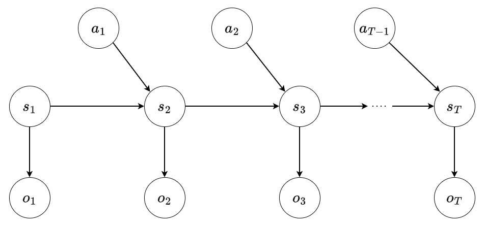

## Graphical model

$s_t$: state at time t
$o_t$: observation at time t
$a_t$: action at time t

## prior
$$
p(s_{1:T}|a_{1:T})=p_0(s_1)\prod_{t=2}^T p_{\psi}(s_t|s_{t-1}, a_{t-1})
$$
## likelihood
$$
p(o_{1:T}| s_{1:T}, a_{1:T})=\prod_{t=1}^T p_{\theta}(o_t|s_t)
$$
## posterior factorization
$$
q(s_{1:T}| o_{1:T}, a_{1:T-1})=q_{\phi}(s_1|o_1)\prod_{t=2}^T q_{\phi}(s_t | o_{1:T}, a_{1:T-1})
$$
## Training
$$
\log{p_{\psi, \theta}(o_{1:T} | a_{1:T-1})} \ge ELBO(o_{1:T}; \psi, \theta, \phi)
$$
$$
ELBO(o_{1:T}; \psi, \theta, \phi) = \sum_{t=1}^T \mathbb{E}_{s_t \sim q_{\phi}(s_t|o_{1:t},a_{1:t-1})} \left[
\log{p_{\theta}(o_t|s_t)}
\right]
$$
$$
- D_{KL}(q_{\phi}(s_1|o_1) || p_0(s_1))
$$
$$
- \sum_{t=2}^T \mathbb{E}_{s_t \sim q_{\phi}(s_t|o_{1:t},a_{1:t-1})} \left[
D_{KL}(q_{\phi}(s_t|o_{1:t},a_{1:t-1}) || p_{\theta}(s_t|s_{t-1}, a_{t-1}))
\right]
$$